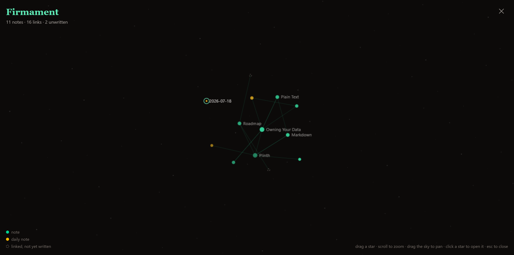
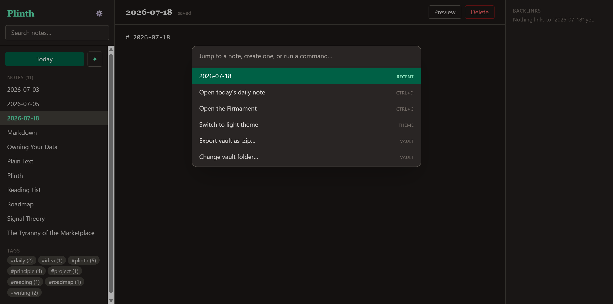
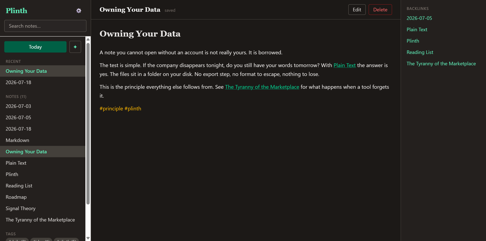

# Plinth

> Plinth is a notebook, not an ecosystem.
> No plugins to break. No marketplace to browse. No subscription.
> Just Markdown files that belong to you.



## A small argument, in the shape of an app

Software wants to own your thinking. It wraps your words in accounts, databases, and formats you can only leave through an export button. Even the tools built to resist this grew back into the thing they replaced. The plain-text notebook got a plugin store. The local-first app got a sync bill.

Plinth is an experiment in the other direction. What if a notes app took nothing from you? No account. No lock-in. No marketplace. No claim on your words at all. What if it stored your knowledge as plain Markdown, so that twenty years from now your ideas are still yours, readable by anything, owing nothing to the company that made the tool?

That is the whole idea. Plinth does the few things a thinking tool needs to do, stores the result as files you already own, and then disappears.

## The refusal

Software should disappear.
Your notes should outlive frameworks, startups, and operating systems.
And a tool for thinking should never grow a marketplace.

## What it does

- **Daily notes** open to today automatically, so capture is one keystroke away
- **Wiki links** connect ideas with `[[Note Name]]` as you type
- **Backlinks** show every note that points back, so structure emerges on its own
- **The Firmament** (`Ctrl+G`) draws the whole vault as a living star map: every note a star, every link a line, daily notes in amber, broken links as dim "unborn" stars. Drag, zoom, click a star to open it. (*Firmament*, in the old sense: the vault of heaven.)
- **Command palette** (`Ctrl+K`) fuzzy-jumps to any note, creates one that doesn't exist yet, or runs an app action, all without the mouse
- **Tags** with a `#tag` explorer to slice across your notes
- **Full-text search** across everything, instant
- **Plain Markdown files** in a folder you own, no database to escape from
- **Local-first**, works offline forever, move the folder and it still works

| Command palette | Preview mode |
| --- | --- |
|  |  |

## Keyboard shortcuts

| Keys | Action |
| --- | --- |
| `Ctrl+D` | Open (or create) today's daily note |
| `Ctrl+G` | Open the Firmament |
| `Ctrl+K` | Open the command palette |
| `Esc` | Close the Firmament or palette |

## What it refuses to do

- No plugins, ever. Nothing to install, nothing to rot.
- No accounts, no cloud, no telemetry.
- No proprietary format. The Markdown files are the app.

## Built in the open

Plinth is free and open source, MIT licensed. Read it, fork it, keep it running long after I stop maintaining it. The files are yours either way, which is the entire point.

**[Download the latest Windows installer](https://github.com/SignalTheoryCo/plinth/releases/latest)** (Windows SmartScreen may warn on the unsigned build; choose "More info", then "Run anyway").

## Tech stack

- [Fable](https://fable.io) — F# compiled to JavaScript
- [Tauri v2](https://v2.tauri.app) — Rust backend for file system + SQLite
- [Feliz](https://zaid-ajaj.github.io/Feliz/) (React) + Tailwind CSS
- SQLite as a rebuildable index/search cache stored inside the vault (`.plinth/index.db`); the Markdown files are always the source of truth

## Build from source

Prerequisites: Node.js 20+, .NET SDK 8+, Rust (stable, MSVC toolchain on Windows) + WebView2 (preinstalled on Windows 11).

```sh
npm install
dotnet tool restore
npm run tauri dev     # compiles F# + Rust, opens the app with hot reload
```

To build a release bundle: `npm run tauri build`.

Frontend-only work doesn't need the Tauri shell: `npm run dev` and a plain
browser tab at `localhost:5173` is enough. In a browser, `src/devMock.js`
installs an in-memory mock backend seeded with a small demo vault (it is a
no-op inside the real app).

## Project structure

```
src-tauri/            Rust backend (Tauri commands, SQLite index, link parser)
src/Plinth/           F# frontend (Feliz components, hooks, utils)
Plinth.fsproj         F# project file (compile order lives here)
```
